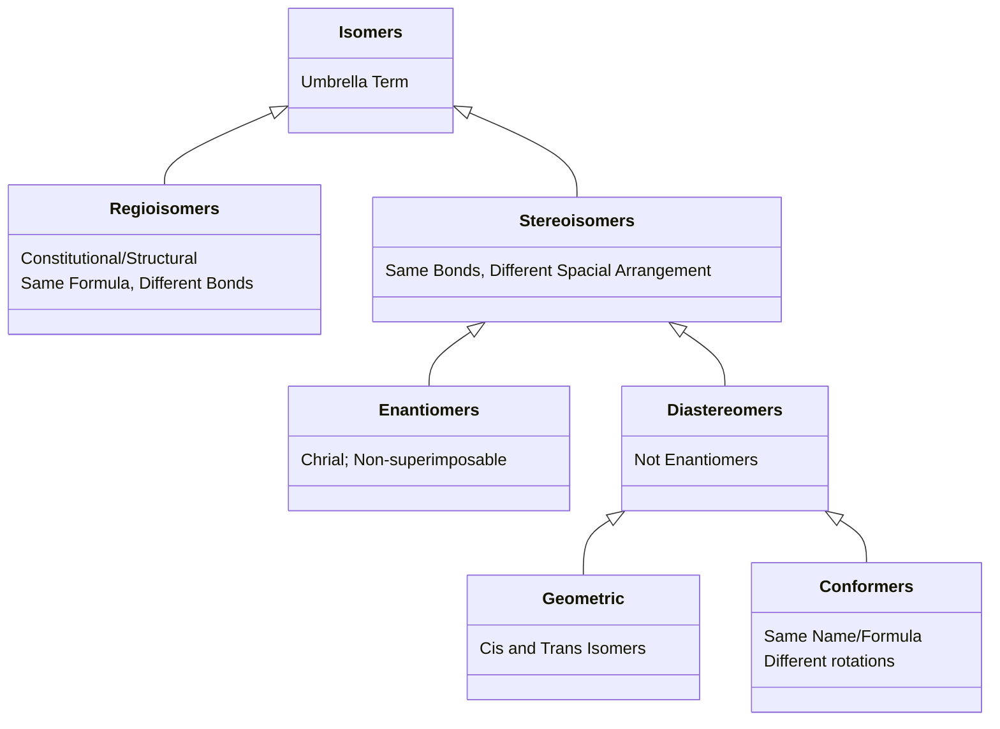

# Exam 2 Notes to Review
The PDF of my notes for this exam can be found [[O-Chem Notes Exam 2.pdf|here]].
# Topics to Review
*Create Cheat Sheet after doing Practice. Only Include what is necessary.*
```ad-important
This is a comprehensive review of the second exam's material made using my lecture notes, SI Sheets/Keys, and the textbook. It is possible that not everything here may be on the exam, and that the exam may cover topics not mentioned below. There is too much information to include on just one front-and-back sheet, so choose what is needed and only include that. Also sorry for any spelling issues. Spellcheck doesn't work in some code blocks :(
$$\textbf{USE AT YOUR OWN RISK}$$
$$\text{Good luck!!!}$$
```
****
## Chapter 4 - The Study of Chemical Reactions
#### Free Radical Mechanisms
- [x] Necessary Reagents for Chlorination and Bromination 
	- Chlorination requires heat or light if not at room temperature
	- Bromination requires both heat and light
```ad-note
title: Notation of Common Reagents
'$\Delta$' is used for heat and '$hv$' is used for light in reagents
```
- [x] Initiation. Propagation, and Termination Steps
	- Propagation Steps require (free radicals)$\cdot$ on either side of the rxn
	- Production of radicals allow the reaction to continue to make more product
	- **MUST use single hook arrows for all single $e^-$ movements!!!**
#### Thermodynamics: Products $-$ Reactants $:(T$ is in Kelvin$)$
- [x] Gibbs Free Energy $\Delta G = \Delta H -T\Delta S\leftarrow$ Equation not necessary
	- The amount of energy available to do work
	- Reactions favored when $-\Delta G$
- [x] Enthalpy $\Delta H$
	- Heat released or absorbed by a reaction
	- **Exothermic:** Heat is $\underline{\text{released}}: -\Delta H$
	- **Endothermic:** Heat is $\underline{\text{absorbed}}: +\Delta H$
	- Reactions tend to favor products with the lowest enthalpy
- [x] Entropy $\Delta S:\underline{\text{Negligible}}\text{ in this class}$ 
	- Disorder in a System
- [x] Bond Dissociation Enthalpies (BDE)
	- Bonds $\underline{\text{require}}$ energy = $+BDE$
	- Bonds $\underline{\text{release}}$ energy = $-BDE$
	- [x] BDE Cleavage
		- **Homolytic:** Free Radicals Created - *Single Fish Hook*
		- **Heterolytic:** Ions Created - *Double Fish Hook*
#### Kinetics: Let $aA + bB \to cC +dD$
The Rate Equation for a Reaction is $\text{rate}=K_r[A]^a[B]^b$
- For some rate constant $K_r$ that is determined Experimentally
- [x] Rate is determined by the slowest step of a Reaction
	- This step is called the rate-determining step
	- [x] Reaction Order
		- $a$ is the order with respect to reactant $A$
		- $b$ is the order with respect to reactant $B$
		- $a+b$ is the overall reaction order
	- [x] Larger $K_r$ means faster equation
- [x] Activation Energy $(E_a)$
	- The minimum kinetic energy molecules must have in order to react
	- Larger $E_a$ correlates to a slower reaction as more energy is required
	- Smaller $E_a$ correlates to a faster reaction as molecules do not need as much energy
- [x] Transition States $(\text{Denoted by a }\ddagger)$
	- Are often notated in brackets with a double dagger outside
`````ad-example
$$\left\lbrack{\ce{C(H_3)--H--Cl}}\right\rbrack^\ddagger$$
```ad-note
title: Too Many Bonds?
In transitions states, bonds are being broken at the same time as they are formed. These compunds are not stable and do not exist for any real amount of time. Because of this, chemists draw dashed lines to signify simoultanious bonds breaking and forming.
```
`````
 - [x] Reaction Coordinate Diagrams
	 - Energy $(\Delta H\text{ or }\Delta G)$ on y-axis
	 - Reaction Coordinate $(time)$ usually on the x-axis
	 - [x] Reading the Diagram
		 - If Products Energy is lower than reactants, Energy Lost $-\Delta H\therefore$ Exothermic
		 - If Products Energy is higher than the reactants, Energy gained  $+\Delta H\therefore$ Endothermic
		 - Transition States are at the 'Humps', or 'Peaks'
		 - Reaction Intermediates are at the 'Dips', or 'Troughs'
		 - For multi-step reactions, the highest energy transition state is the activation energy
- [x] Nomenclature of Hydrogens
	- Primary vs. Secondary vs. Tertiary Hydrogens![[Degrees of Hydrogens.png]]
- [x] Free Radical Stability
	- $\boxed{\text{methyl < primary < secondary < tertiary}}$ ![[Free Radical Stability.png]]
 - [x] Hammonds Postulate
	 - Related species that are similar in energy are also similar in Structure
	 - Transition State structure resembles the structure of the closest stable species
	 - **Exothermic:** Transition State resembles the products
	 - **Endothermic:** Transition State resembles the reactants
	 - [x] Bromination vs. Chlorination ![[Cl v Br.png]]
		 - It is crucial to know that bromination is **endothermic** and chlorination is **exothermic**
 - [x] Selectivity
	 - Bromination is much more selective than Chlorination
		 - Chlorination reactions tend towards a 50:50 split
		 - Bromination reactions tend towards a larger split (i.e. 97:3)
- [x] Reactive Intermediates 
	![[Intermediates.png]]
	- [x] Carbocations - Electrophile
		- $sp^2$ hybridized Carbon with a vacant p orbital
		- Unsaturated carbocations can be stabilized by **resonance**
		- Highly substituted carbocations are more stable as the positive charge is stabilized by the **inductive effect**
		- **Hyperconjugation:** The empty p-orbital is made more stable through the neighboring p-orbitals on carbons
	- [x] Carbon Radicals - Electrophile
		- $sp^2$ hybridized carbon without a vacant p orbital
		- Unsaturated carbon radicals can be stabilized by resonance
		- **Hyperconjugation** and the **Inductive Effect** stabilize these
	- [x] Carbanions - Nucleophile
		- $sp^3$ hybridized carbon
		- Follows opposite pattern as carbon is already electron rich
		- **Hyperconjugation** and the **Inductive Effect** still occur but decrease stability as carbon doesn't want to bear more negative charge
	- [x] Carbenes - Both nucleophilic and electrophilic
		- Neutral Carbons that are $sp^2$ hybridized
		- Have an empty p orbital
	- [x] Summary of Stability and Properties![[Intermediate Stability.png]]
## Chapter 5 - Stereochemistry
#### Chirality and Isomerism
- [x] Chiral Molecules (or Objects) have a different mirror image than its original
	- For a carbon or other molecule to be considered a chiral center, or asymmetric, it must have 4 unique groups bonded to it
	- **Achiral:** Mirror images that *can* be superimposed
	- **Enantiomers:** Compounds that are non-superimposable mirror images
```ad-note
title: Mirror Images and Planes of Symmetry
Compounds that have a plane of symmetry are achrial. Even non-planar compounds like cic-cyclic structures can be superimposed along a line of symmetry.
```
- [ ] Chirality of Conformers
	- If fast equilibrium exists between two chiral conformers, the molecule is not chiral
	- To determine whether of not a conformationally mobile molecule is chiral, consider its most symmetric conformation
- [ ] Non-mobile Conformers
	- Sterically crowded molecules can force rotations such that conformers are no longer superimposable
	- Staggered conformers are chiral
- [x] Isomerism
	- Structural/Constitutional: Same Formula but Different Bonds
	- Stereoisomers
		- Enantiomers: Chiral, Non-superimposable Isomers
		- Diastereomers: Anything that isn't an enantiomer
			- Geometric Isomers: Cis/Trans
			- Conformers: Rotation varies

#### Configuration
- [x] R vs. S Configuration
	- Distinguishes between enantiomers
	- [x] Algorithm using Cahn-Ingold-Prelog rules
		1. **Assign Priority:** Atoms with higher atomic mass get higher Priority
		2. **Break Ties:** Look down chain to break ties
			- Compare atomic masses of atoms connected to the chain
			- Treat double and triple bonds as if they are multiple bonds
		3. **Assign Configuration:** Place Lowest priority group in the back (typically H), and draw arrow from highest to lowest priority
			- **Clockwise Arrow:** R
			- **Counterclockwise Arrow:** S
			- If lowest priority group is facing out instead of back, draw the arrow and assign the opposite configuration.
	- R and S configurations deal with the absolute configuration of a compounds
	- (+) and (-) deal with the reflection of polarized light
#### Properties of Enantiomers
- [x] Difficult to extract enantiomers due to similar properties
	- Same melting point, boiling point, and reflective indices
	- Enantiomers reflect light in opposite directions
		- **Racemic Mixtures:** Contain a 50:50 split of enantiomers. Mixture may have different properties (bp and mp) than the enantiomers that made it.
```ad-note
If optically inactive reagents combine to forma a chiral molecule, a racemic mixture is formed.
```
#### Allenes
- [x] Contain the $\ce{C=C=C}$ Unit. Central C is $sp$ hybridized
	- Can be chiral despite not containing an asymmetric carbon
	- To be chiral, the two carbons on the end must be attached to different groups.
	*This means that the end carbons cannot be connected to two methyl groups, but a methyl and a hydrogen would be acceptable.*
#### Fischer Projections
- [x] Always have the lowest and highest priority groups pointing out
	- **Vertical Lines:** Behind the Plane (pointing back)
	- **Horizontal Lines:** Into the Plane (pointing up)
	- Place longest carbon chain on vertical line
	- Highest oxidized (most oxygens) carbons on top of drawing
- [x] Configurations
	- Since the lowest priority group is pointing out of the page, the configuration must be reversed.
	- Assign Priorities as normal, draw arrow linking highest to lowest, reverse direction
- [x] $180\degree$ rotations are allowed, but $90\degree$ rotations change the projection completely!
- [x] Summary of Fischer Projections from Textbook
	![[FISCHER Summary.png]]
#### Multiple Chiral Centers
- [x] Diastereomers are just stereoisomers that are not enantiomers
	- Most commonly geometric isomers or compounds containing two or more chiral centers. Cis/Trans Isomers are not mirror images of each other, so they are diastereomers
	- [x] When there are more than one chiral centers
		- **Enantiomers:** Opposite configuration at all centers
		- **Diastereomers:** Some centers have same configuration, others don't
		- **Meso:** Have internal mirror plane $\to$ superimposable. These compounds are achiral despite containing chiral centers themselves.
#### Absolute vs. Relative Configuration
- [x] Absolute Configuration
	- Detailed picture of a molecule, including how atoms are arranged in space. This is more commonly known as the (R) and (S) configuration at a chiral center
- [x] Relative Configuration
	- Experimentally determined relationship between the configurations of two molecules. This is commonly known as the (+) and (-) configuration, or formally as (D) and (L)
```ad-note
title: Watch Out!
These two have almost nothing to do with each other. They both give you good information about the compounds, but you cannot determine relative configuration from absolute configuration. It must be done experimentally!
```
#### Properties of Diastereomers
- [x] Different Physical Properties
	- Easier to work with than enantiomers as these can be separated through ordinary means in the lab. Melting points can be drastically different for these compounds.
	![[phys dias.png]]
## Chapter 6 - Alkyl Halides; Nucleophilic Substitution
#### Nomenclature
- [x] Classifications
	- **Alkyl Halides:** Halogen bonded directly to $sp^3$ carbon
	- **Vinyl Halides:** Halogen bonded to $sp^2$ carbon of an alkene
	- **Aryl Halides:** Halogen bonded to $sp^2$ carbon of benzene ring
- [x] Common Names - Replace with actual name of halide
	- $\ce{CH2X2}$ is Methylene Halide 
	- $\ce{CHX3}$ is Haloform
	- $\ce{CX4}$ is Carbon tetrahalide
- [x] Dihalides (two halogens)
	- **Geminal:** A dihalide with both halogens on the same carbon atom
	- **Vicinal:** A dihalide with the halogens on adjacent carbon atoms
- [x] Degrees of Halides - Replace X with the halide
	- $\ce{CH3X}$ - Methyl Halide
	- $\ce{CH2RX}$ - Primary ($1\degree$) Halide
	- $\ce{CHR2X}$ - Secondary ($2\degree$) Halide
	- $\ce{CR3X}$ - Tertiary ($3\degree$) Halide
#### Bond Dipole Strength
- [x] Size Matters!
	- $\ce{C-Cl > C-F > C-Br > C-I}$
	- I is much larger, so it is more polarizable.
	- Reversing the order in the above bullet point yields the order of best leaving groups
#### Allylic Bromination
- [x] NBS is the best reagent to use for allylic Bromination
	- Formally known as N-bromosuccinimide
	- Keeps the concentration of $\ce{Br2}$ Low![[NBS.png]]
#### Basicity vs. Nucleophilicity
- [x] **Basicity:** Defined by the equilibrium constant from abstracting a proton
- [x] **Nucleophilicity:** Defined by the rate of attack on electrophile
- [x] Trends in Nucleophilicity
	1. Negatively charged nucleophiles are stronger than neutral ones
	2. Decreases from left to right on the periodic table
	3. Increases down groups of the periodic tables $\leftarrow$ Size and Polarizability Increase
	- Summary of Trends![[NUC trends.png]]
	- Some Common Nucleophiles![[Common NUCs.png]]
#### $\textbf{S}_N\textbf{2}$ Reaction
- [x] Second Order Nucleophilic Substitution
	- $\text{rate}=K_r[Alkyl\ Halide][Nucleophile]$
- [x] One Step, Concerted Reaction
	- NO intermediates formed, only transition state![[Sn2.png]]
- [x] Characteristics
	- Strong Nucleophile preferred - faster reaction rate
		*Strong Nucleophiles are not always basic, but all strong bases are strong nucleophiles*
	- Backside Attack $\to$ Inversion @ Chiral Carbon 
		*This is a result of the steric effect because the large groups prevent the nucleophile from attacking the same side that the halogen left from*
	- Halogen bond breaks at the same time the Nuc makes the bond 
	- Transition State is highest energy
	- $\ce{CH3X} > 1\degree>2\degree>>3\degree$
		- That is to say $3\degree$ does not react via $S_N2$ due to steric hinderance
	- **Solvent Effect:** Prefers Aprotic Solvents. Much faster in these conditions
		*This is because polar solvents have acidic hydrogens that solvate the nucleophile leading to reduced nucleophilicity*
	- **Crown Ethers:** A popular aprotic solvent to use. 
		- Solvate the Cation $\to$ increased nucleophilic strength of anion increases
		*An example is 10-crown-6 which solvates the $K^+$ cation*
	- **Polarizability Effect:** Prefers larger atoms as leaving groups as they have a soft shell that can hold the negative charge more easily.
```ad-tldr	
Larger atoms are more polarizable $\therefore$ they are more stable leaving groups.
```
- [x] Best Leaving Groups
	- $e^-$ withdrawing that can polarize the carbon atom
	- Stable once they leave (i.e. not a strong base after rxn)
	- Polarizable to stabilize $\ddagger$
#### $\textbf{S}_N\textbf{1}$ Reaction $\leftarrow$ Racemization Occurs
- [x] First Order Nucleophilic Substitution
	- $\text{rate} = K_r[Alkyl\ Halide]$
- [x] Multi Step, Unimolecular,  Reaction
	- Has a carbocation intermediate that can rearrange![[Sn1.png]]
- [x] Characteristics
	- Weaker Nucleophile preferred
	- Opposite preference of Alkyl Halide: $3\degree>2\degree>1\degree>>\ce{CH3X}$
		- That is to say $\ce{CH3X}$ cannot react via $S_N1$
	- **Solvation Effect:** Polar Protic Solvents are preferred because it solvates both the ions produced in the mechanism
	- **Structure of Carbocation:** The intermediate wants to be as stable as possible, so the molecule will rearrange itself to make this happen.
		*Recall carbocation stability:* $3\degree > 2\degree>1\degree>\ce{CH3+}$
		- Carbocation will rearrange to form a more stable version of itself
			- **Hydride Shift:** $\ce{H-}$ on adjacent carbon moves
			- **Methyl Shift:** $\ce{CH3}$ on adjacent carbon moves
			*Note that 1,2- is a prefix for these shifts because it **must** occur at adjacent carbon atoms*
	- **Stereochemistry:** Produces a mixture of enantiomers
		*This is because Carbocations have a vacant p orbital that can be attacked on either side. If the compound has a chiral center where the reaction takes place $\implies$ mixtures of retention and inversion of the original configuration*
- [x] Summary of the two reactions - My version and the Textbooks
	*These should be memorized for the most part, but it doesn't hurt to include them on the cheat sheet*
	- My version from SI Session #11![[Sn1 vs. Sn2 my ver.png]]
	- The textbooks version on pg.286![[Sn1 vs. Sn2.png]]
#### Concluding thoughts
```ad-tip
title: It never stops...
Remember to make sure you're familiar with the previous exam topics, everything builds off of the topics prior, though I've heard you can kiss chair conformations goodbye.
$$
\textbf{Good Luck on the Exam!!!}
$$
```